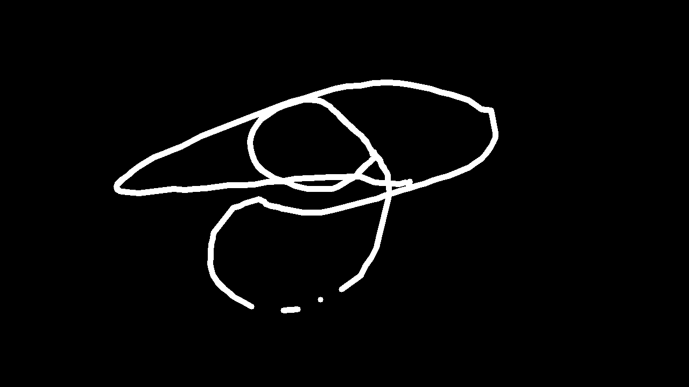

# HandSketch
This is a program that allows you to draw using hand gestures with OpenCV.

HandSketch is a real-time, webcam-based virtual drawing tool that uses hand gestures to switch between brush tools, colors, eraser, and even activate a dramatic Iron Man-style AR beam that clears the canvas.

## Requirements
- python 3.10 or below (my environment is python 3.10.11)
- Note: `mediapipe` may not work with Python versions above 3.10.
- libraries: time, numpy, cv2, mediapipe, math

## 📁 Project Structure

.
├── painting.py             # Main app: drawing, gesture handling, canvas logic
├── handTracking.py         # Hand detection using MediaPipe
├── handClassification.py   # Gesture classification logic (fingers → action)
├── ironMan.py              # Iron Man beam effect and canvas clear
├── README.md               # Project instructions and gesture guide
└── requirements.txt        # (Optional) Python dependencies list

## ✨ Features
- 🖌️ Draw with your index finger — no mouse or touchscreen needed
- 🧽 Erase mode with gesture switching
- 🎨 Interactive color palette with gesture selection
- 📏 Adjustable brush thickness (thin / medium / thick)
- 💾 Save full canvas or only the drawing with hand gestures
- 💥 Iron Man AR beam effect: hold both hands open to trigger a beam that clears the canvas

## 🖐️ Hand Gesture Guide

| ID  | Gesture Type     | Gesture Description                                            | Function                                  |
|-----|------------------|----------------------------------------------------------------|-------------------------------------------|
| 1   | **Right hand**   | Index finger only                                              | ✏️ Draw (default mode)                    |
| 2   | **Right hand**   | Index + middle fingers **together**                            | 🧽 Erase mode (toggle)                    |
| 3   | **Right hand**   | Index + middle + ring fingers                                  | Thin brush or eraser                     |
| 4   | **Right hand**   | Index + middle + ring + pinky fingers                          | Medium brush or eraser                   |
| 5   | **Right hand**   | All 5 fingers open                                             | Thick brush or eraser                    |
|     |                  |                                                                |                                           |
| 0   | **Both hands**   | Both fists (0 fingers)                                         | 🎨 Enter color palette (select with index finger) |
| 6   | **Both hands**   | Right: 5 fingers + Left: thumb only                            | 💾 Save full canvas (after 3 second)     |
|     |                  |                                                                | (countdown shown on screen but not saved)|
| 7   | **Both hands**   | Right: 5 fingers + Left: thumb + index                         | 💾 Save **drawing only** (on black background) |
| 10  | **Both hands**   | All 10 fingers open                                            | 💥 Iron Man beam effect + canvas clear   |

## Preview Image of saved 

Full canvas saving by 6 fingers(3 seconds waiting time)

Only drawing with black background

## 🖥️ How to Use

1. Download the whole files of this repository.

2. Run the app by executing `painting.py`

3. Enjoy the application with the guide above.

4. Quit the app: press 'q' on the keyboard.

## Demo Video

▶️ [Watch the demo on YouTube](https://youtu.be/h_TFbRmyO_Y)

## 📄 Acknowledgements

[computervision.zone](https://www.computervision.zone/courses/ai-virtual-painter/)

[AI Virtual Painter](https://www.youtube.com/watch?v=ZiwZaAVbXQo)